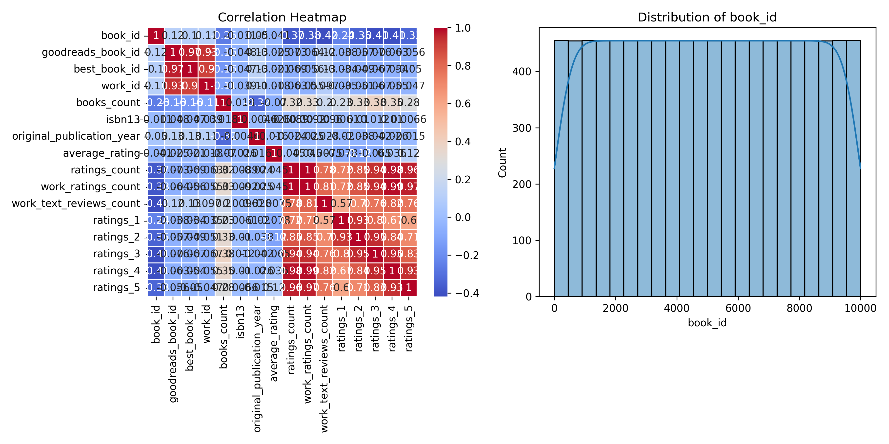

# Data Analysis Report

## Dataset Overview
- **Total Rows**: 10000
- **Total Columns**: 23
- **Column Types**: {'book_id': dtype('int64'), 'goodreads_book_id': dtype('int64'), 'best_book_id': dtype('int64'), 'work_id': dtype('int64'), 'books_count': dtype('int64'), 'isbn': dtype('O'), 'isbn13': dtype('float64'), 'authors': dtype('O'), 'original_publication_year': dtype('float64'), 'original_title': dtype('O'), 'title': dtype('O'), 'language_code': dtype('O'), 'average_rating': dtype('float64'), 'ratings_count': dtype('int64'), 'work_ratings_count': dtype('int64'), 'work_text_reviews_count': dtype('int64'), 'ratings_1': dtype('int64'), 'ratings_2': dtype('int64'), 'ratings_3': dtype('int64'), 'ratings_4': dtype('int64'), 'ratings_5': dtype('int64'), 'image_url': dtype('O'), 'small_image_url': dtype('O')}

## LLM Insights
### Dataset Analysis: Key Trends and Patterns

The dataset provided contains information on 10,000 books with 23 attributes each. Below is an analysis of trends, patterns, and potential recommendations based on the key statistics.

#### Key Trends:

1. **Authors and Popularity**:
   - There are 4,664 unique authors in the dataset, indicating a diverse range of literary contributions. Stephen King is the most frequent author, appearing 60 times, suggesting his works have significant popularity.

2. **Publication Trends**:
   - The average original publication year is approximately 1982, with the most recent publication year being 2017. This suggests a blend of both classic and contemporary literature in the dataset.

3. **Ratings and Reviews**:
   - Average ratings across the dataset hover around 4.00, indicating generally favorable reception. However, the standard deviation (0.25) suggests there is variability in these ratings, with some books receiving much higher ratings than others.
   - The distribution of ratings (ratings_1 to ratings_5) reveals a wider interest, with a considerable number of ratings being given for higher ratings (ratings_4 and ratings_5), suggesting a community engaged in reviewing and rating books.

4. **Language Diversity**:
   - There are 25 unique language codes, with 'eng' (English) being the most prevalent, making up a significant majority of the dataset (6,341 occurrences). However, the presence of multiple languages indicates a potential market for translated works.

#### Missing Values:
- Significant missing values exist in the ISBN (700 missing), original titles (585 missing), and language codes (1,084 missing). This could affect data integrity and the ability to perform comprehensive analyses or recommendations.

#### Recommendations:

1. **Data Cleaning**:
   - Address the missing values, especially in key fields like ISBN and language codes, to enhance dataset usability. This may involve imputing values or validating the data against authoritative sources.

2. **Enhanced Author Marketing**:
   - Consider promoting works by prolific authors like Stephen King, as they attract more attention and ratings. Developing author-centered marketing campaigns or spotlight features could be beneficial.

3. **Promote Diversity**:
   - Emphasize the multilingual nature of the dataset to attract a broader audience. Recommend a selection of books in various languages to enhance user engagement across different linguistic demographics.

4. **Trend Analysis for Publication**:
   - Further investigate trends relating to publication years.

## Visualizations

