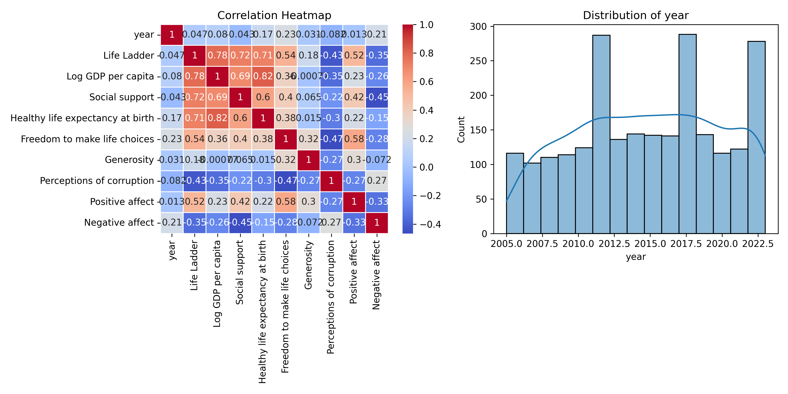

# Data Analysis Report

## Dataset Overview
- **Total Rows**: 2363
- **Total Columns**: 11
- **Column Types**: {'Country name': dtype('O'), 'year': dtype('int64'), 'Life Ladder': dtype('float64'), 'Log GDP per capita': dtype('float64'), 'Social support': dtype('float64'), 'Healthy life expectancy at birth': dtype('float64'), 'Freedom to make life choices': dtype('float64'), 'Generosity': dtype('float64'), 'Perceptions of corruption': dtype('float64'), 'Positive affect': dtype('float64'), 'Negative affect': dtype('float64')}

## LLM Insights
### Dataset Overview

The dataset consists of 2,363 rows and 11 columns, representing various well-being indicators across different countries over the years, with key indicators such as Life Ladder, Log GDP per capita, Social Support, and others. A significant amount of missing values exists, particularly in the Generosity (81), Perceptions of corruption (125), and Healthy life expectancy at birth (63).

### Trends and Patterns

1. **GDP and Life Satisfaction**: The average Log GDP per capita is approximately 9.40, indicating that many countries in the dataset experience relatively high economic status. The mean Life Ladder score, which encapsulates subjective well-being, is 5.48, suggesting a moderate level of life satisfaction. A potential correlation between these two measures is expected, as higher GDP is typically associated with greater life satisfaction.

2. **Social Support**: The mean score of Social Support is 0.81, suggesting that, on average, individuals feel they enjoy substantial social support. This could be an influential factor in enhancing life satisfaction, reflecting a trend wherein higher social support correlates with improved well-being.

3. **Corruption Perceptions**: The average score for Perceptions of corruption is 0.74, indicating a notable concern in the countries analyzed. A higher perception of corruption could negatively impact the Life Ladder scores, suggesting a potential area of focus for policymakers.

4. **Emotional Well-Being**: The dataset reveals that Positive affect (mean: 0.65) is generally higher than Negative affect (mean: 0.27), which points towards a positive emotional climate in these countries. However, efforts should be made to further understand what drives positive feelings and mitigate negative experiences.

### Recommendations

1. **Address Missing Values**: Given the significant amount of missing values, especially in Generosity and Healthy life expectancy, it would be prudent to explore methods such as imputation, or further data collection, to enhance the dataset’s comprehensiveness. This will improve analyses and provide more actionable insights.

2. **Focus on Corruption and Governance**: With corruption perceptions being a significant area of concern, governments should focus on enhancing transparency and governance measures. Initiatives to combat corruption could positively impact not only public trust but also overall happiness and social support.

3. **Leverage Social Support Systems**: Given the high levels of reported social support, strategies to further enhance community and social networks can be beneficial. Programs promoting community interactions and support

## Visualizations

