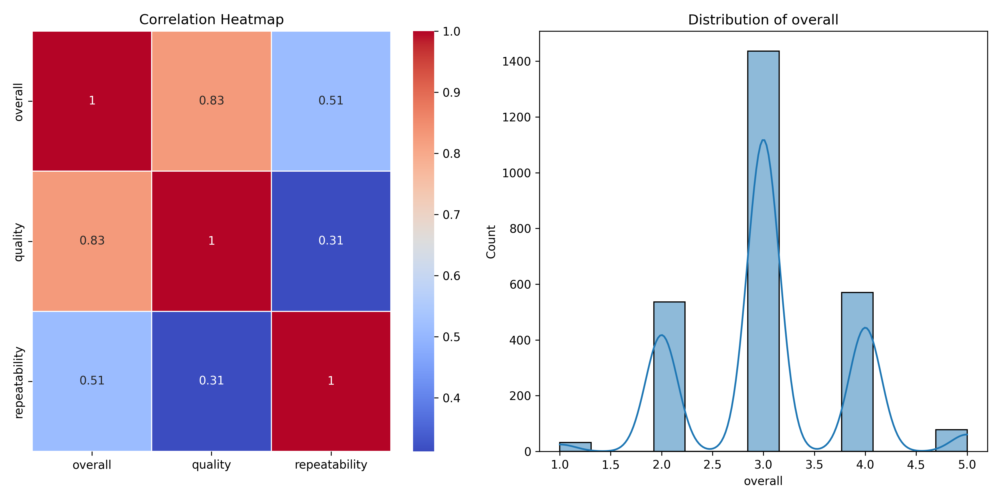

# Data Analysis Report

## Dataset Overview
- **Total Rows**: 2652
- **Total Columns**: 8
- **Column Types**: {'date': dtype('O'), 'language': dtype('O'), 'type': dtype('O'), 'title': dtype('O'), 'by': dtype('O'), 'overall': dtype('int64'), 'quality': dtype('int64'), 'repeatability': dtype('int64')}

## LLM Insights
### Dataset Overview and Insights:

The dataset contains **2652 records** with **8 columns**. Here are some key observations and trends:

#### Key Findings:

1. **Date Information:**
   - The "date" column has **99 missing values** out of **2652** total. 
   - It shows a diverse range of dates with **2055 unique entries**, indicating that the dataset covers various events over time. The most frequent date, '21-May-06,' appears **8 times**.

2. **Language Distribution:**
   - The dataset includes **11 languages**, with **English** being the most common, representing **49.1%** of the entries (1306 occurrences). This suggests a possible focus on content predominantly in English.

3. **Content Type:**
   - The majority of entries are categorized as **movies** (84% or **2211 occurrences**). This trend could highlight a focus on film-related data, which may skew analyses or insights toward this medium.

4. **Title Variability:**
   - There are **2312 unique titles**, illustrating a wide variety of content. However, certain titles like "Kanda Naal Mudhal" show a higher frequency (**9 occurrences**), suggesting some popular content.

5. **Contributors:**
   - The "by" column has **262 missing values**, but there are **1528 unique contributors**. The top contributor, **Kiefer Sutherland**, appears **48 times**, indicating the presence of well-known figures within the dataset.

6. **Overall Ratings:**
   - The overall score has a mean of **3.05** (out of 5), indicating a generally positive sentiment toward the content. The quality and repeatability scores are similarly positive, with means of **3.21** and **1.49**, respectively.

7. **Ratings Distributions:**
   - The overall ratings are fairly consistent with **75% scoring at least a 3**, suggesting that a significant portion of the entries maintains a solid quality standard.

#### Recommendations:

1. **Data Cleaning and Imputation:**
   - Address the missing values in the "date" and "by" columns by implementing appropriate imputation strategies or considering these entries for removal depending on the analysis' needs.

2. **Explore Temporal Trends:**
   - With a rich range of unique dates, consider analyzing trends over time—such as how the popularity of different types of content (movies

## Visualizations

